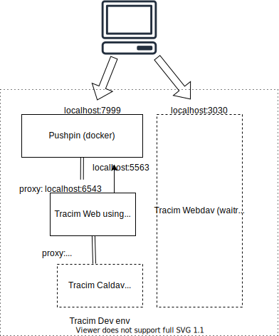

# Install Live Message mecanism for development purpose

## Web Dev architecture

A simple architecture diagram of web apps running in a dev environnement
with default port, running on localhost:

Note: Webdav and caldav process are mostly optional for dev process. You can run this if you
need to test agenda app or webdav.

## Install Pushpin in docker

On ubuntu/debian:

~~~bash
apt install docker.io docker-compose
~~~

:warning: do not install pushpin package as it will conflict with the docker based pushpin (`apt remove pushpin` if installed).

## Some configuration needed

you need to set tracim config like this to use default pushpin port:

~~~ini
basic_setup.website_base_url = http://localhost:7999
live_messages.control_uri = http://localhost:5561
~~~

:warning:  Temporary, you also need to ensure "jobs.processing_mode" parameter is unset or set to "sync".

## Run tracim with Pushpin (dev)

First move to `backend` dir:

~~~bash
cd backend
~~~

run pushpin docker (from tracim root dir):
~~~bash
docker-compose up -d pushpin
~~~

for cypress test, you should use:
~~~bash
PUSHPIN_CONFIG_DIR=./pushpin_cypress_config docker-compose up -d pushpin
~~~

then run tracim:
~~~bash
pserve development.ini
~~~

or, for cypress tests:
~~~bash
pserve cypress_test.ini
~~~

:warning: pushpin for dev and pushpin for cypress cannot be started at the same time (they do use same ports)

you can check if pushpin reverse-proxy works correctly:

~~~bash
firefox localhost:7999
~~~

### More info about docker

to stop "pushpin" containers (from `backend` directory):

~~~bash
docker-compose down
~~~

to see running container list (pushpin container will be named `backend_pushpin_1`):

~~~bash
docker ps
~~~

## Manually testing live messages

To manually test live messages, you can first open a connexion on live message stream for one user:
(this use the default admin user, of course you can do this with other users too)

~~~bash
http -S -a admin@admin.admin:admin@admin.admin localhost:7999/api/users/1/live_messages
~~~

And you can test message with this command:
(in this example, we use use also the default admin user)

~~~bash
tracimcli dev test live-messages -u 1 -d
~~~
